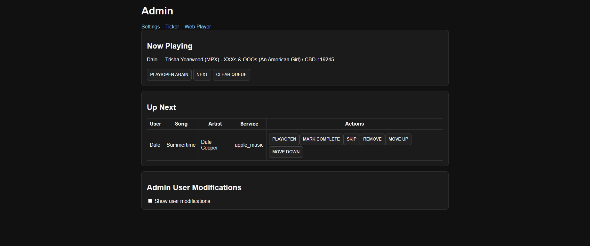
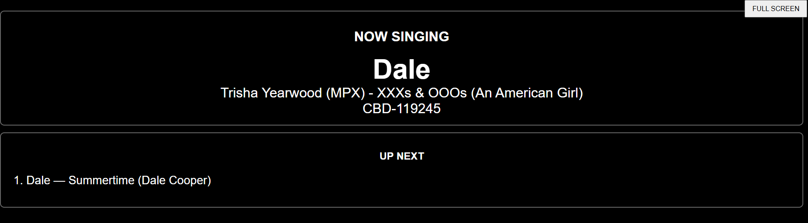
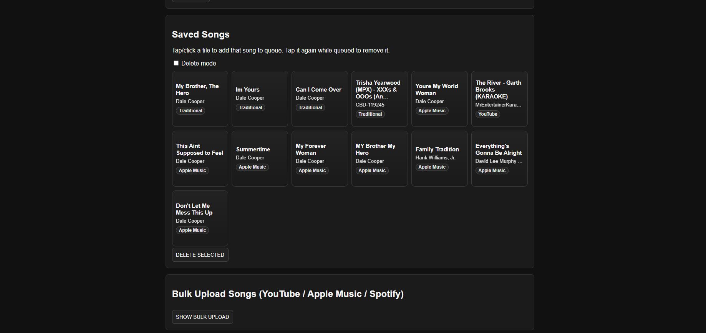
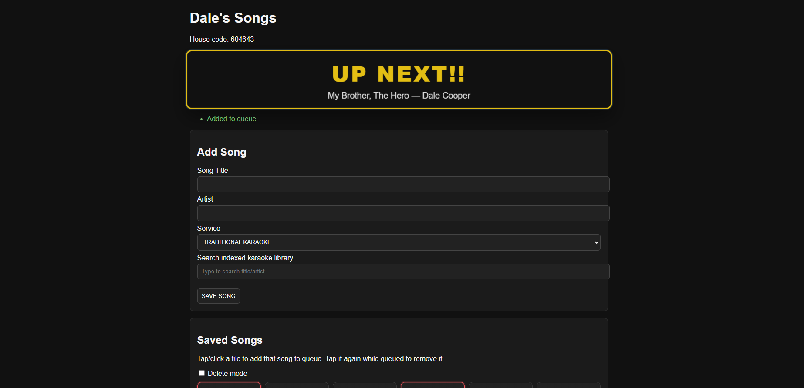
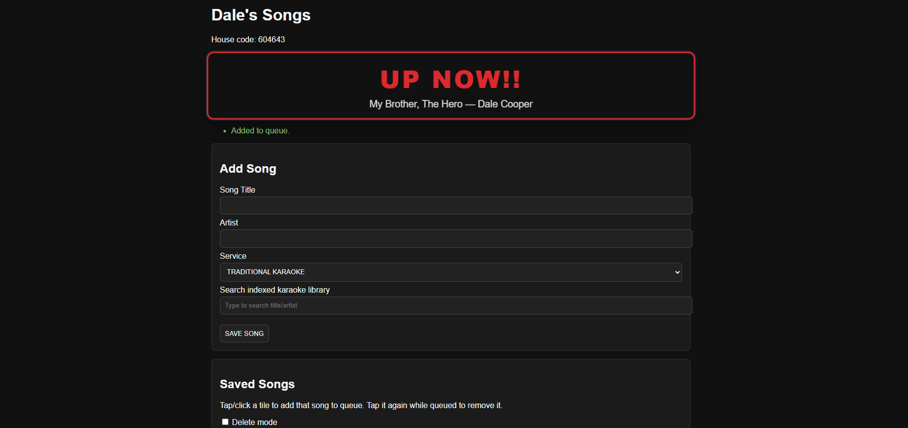
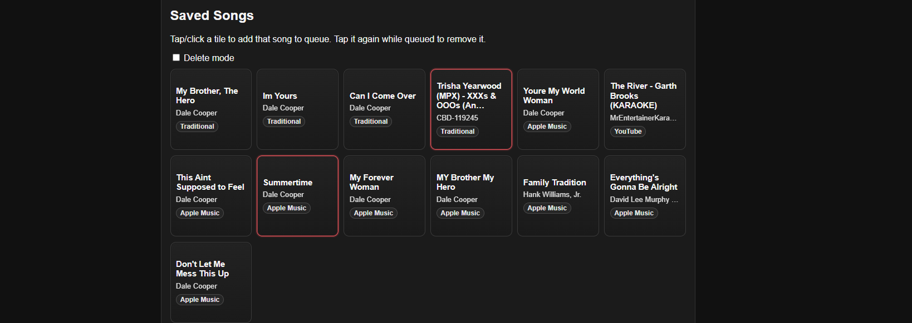
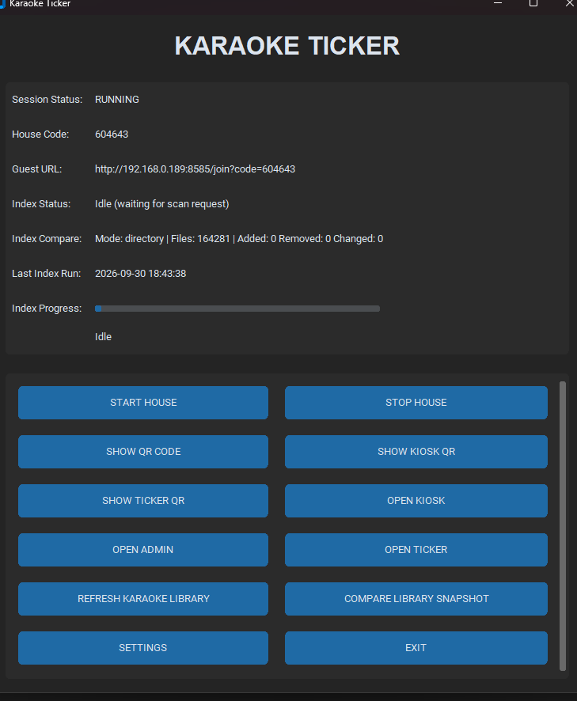
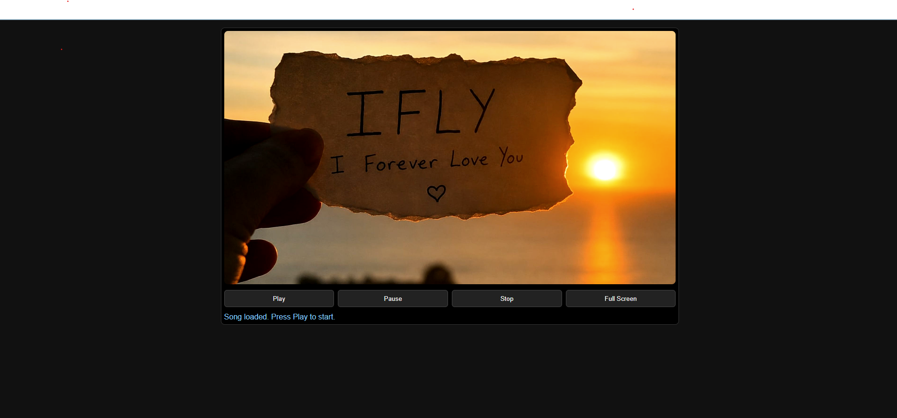

# Karaoke Ticker

Karaoke Ticker is a complete standalone karaoke application.

It is a Windows-first karaoke host application built with CustomTkinter, Flask, Flask-SocketIO, and SQLite. It provides a local operator GUI, phone-friendly guest pages, live admin and ticker views, indexed traditional karaoke search, and browser-based queue updates.

External applications are optional.

This README reflects the current app workflow. No automation controller setup is required to get started.

## What the App Does

Karaoke Ticker manages a karaoke night with:

- persistent singers
- persistent saved songs per singer
- queue management with live updates
- indexed traditional karaoke library search
- YouTube and Apple Music link support
- QR-code join flow for guests on the same network
- admin, kiosk, ticker, and player web pages
- optional Kanto launch for local karaoke files
- in-page guest notifications such as **UP NEXT!!** and **UP NOW!!**

## Screenshots

### Admin


### Ticker / Live Queue


### User Bulk Upload


### Up Next / Singing Now



### Add to Queue


### House Session Join


### Player Fullscreen


## Current Runtime Model

The application has two main entry modes:

- `main.py` launches the desktop operator GUI
- `app.py` can run the Flask/Socket.IO server directly

For normal use, start the desktop GUI. It handles house/session control and opens the web surfaces used by guests and the host.

## Requirements

### Operating system

- Windows 10 or Windows 11 recommended

### Software

- Python 3.11 or newer
- A modern desktop browser for admin, ticker, kiosk, and player pages
- Optional: external media application executable (for example Kanto, VLC, mpv, Kodi, IINA) if you choose External Application playback mode

### Python dependencies

Installed from `requirements.txt`:

- Flask
- Flask-SocketIO
- SQLAlchemy
- customtkinter
- qrcode
- Pillow
- rapidfuzz
- pytest
- pyinstaller

## Project Layout

```text
Karaoke-copilot-karaoke-ticker-app/
├── app.py                  # Flask + Socket.IO app factory and server entry
├── main.py                 # Desktop GUI entrypoint
├── gui.py                  # Operator desktop interface
├── config.py               # Runtime defaults and paths
├── requirements.txt        # Python dependencies
├── run.bat                 # Bootstrap venv, install deps, start GUI
├── build.bat               # Build Windows executable
├── karaoke/                # Core app logic, models, services, indexing, launchers
├── web/                    # Flask routes, templates, static assets
├── tests/                  # Automated test suite
├── data/                   # SQLite database and generated app data
└── logs/                   # Application logs
```

## Quick Start

If you want the fastest path to a running app on Windows:

1. Open a Command Prompt or PowerShell window in the repository root.
2. Run:

```bat
run.bat
```

What `run.bat` does:

1. Creates `.venv` if it does not already exist
2. Upgrades `pip`
3. Installs `requirements.txt`
4. Starts the desktop GUI with `main.py`

## Full Getting Started Guide

### 1. Clone or copy the repository

Place the project in a local folder on the Windows machine that will run karaoke night.

### 2. Create and activate the virtual environment manually (optional)

If you do not want to use `run.bat`, you can set up the environment yourself:

```bat
py -3 -m venv .venv
.venv\Scripts\python.exe -m pip install --upgrade pip
.venv\Scripts\python.exe -m pip install -r requirements.txt
```

### 3. Start the app

Recommended desktop launch:

```bat
.venv\Scripts\python.exe main.py
```

Optional direct web-server launch:

```bat
.venv\Scripts\python.exe app.py
```

Use `main.py` for normal operation. It gives you the operator GUI with session controls, QR generation, and launch shortcuts.

### 4. Open Settings on first run

In the GUI, click **SETTINGS** and configure the values you need.

Important settings:

- **House Name** - display name for the karaoke session
- **Karaoke Folder** - root folder for your traditional karaoke files
- **Kanto Executable Path** - optional; leave blank to use normal Windows file association
- **Port** - web server port used for guest/admin/ticker pages
- **Upcoming singers count** - how many singers appear in the ticker up-next area
- **Singer Rotation** - enable round-robin fairness or leave off for FIFO behavior

### 5. Build the karaoke library index

After saving settings:

1. Click **REFRESH KARAOKE LIBRARY**
2. Wait for the index status and progress to complete
3. Confirm the index is ready before inviting guests to search traditional songs

The traditional karaoke search relies on this indexed library.

### 6. Start a house session

Click **START HOUSE** in the GUI.

When a session starts, the app:

- creates an active house session
- generates a 6-digit house code
- starts or reuses the local Flask-SocketIO server
- shows a guest join URL using your LAN IP and configured port

Example guest URL:

```text
http://192.168.1.50:8585/join?code=482731
```

### 7. Share access with guests

You can invite guests by using any of the GUI shortcuts:

- **SHOW QR CODE**
- **SHOW KIOSK QR**
- **SHOW TICKER QR**
- **OPEN KIOSK**
- **OPEN ADMIN**
- **OPEN TICKER**

Guests must be able to reach the host machine over the same network unless you intentionally expose the app another way.

## Daily Operator Workflow

### Start of the night

1. Launch the GUI
2. Confirm settings are correct
3. Refresh the karaoke library if your local files changed
4. Start the house
5. Open admin and ticker pages
6. Share the join QR code or URL with guests

### During the night

Use the GUI and admin page to:

- monitor the active house code
- manage the queue
- play or open songs
- show ticker output on a TV or second screen
- keep the library current if local files changed before the house starts

### End of the night

Click **STOP HOUSE**.

This:

- invalidates the current house code
- marks the session as stopped
- preserves users, saved songs, and history in the database

## Guest Experience

Guests join from the `/join` page on their phone or another device.

### Join flow

1. Open the join URL or scan the QR code
2. Enter the house code
3. Choose either:
   - a new display name, or
   - an existing saved display name
4. Open the user page

### On the guest user page

Guests can:

- save songs to their personal list
- search the indexed traditional karaoke library
- add YouTube or Apple Music links
- tap a saved song tile to add it to the queue
- tap the same queued tile again to remove it from the waiting queue
- remain on the page to receive **UP NEXT!!** and **UP NOW!!** flashing notifications

## Song Sources

### Traditional karaoke

Traditional karaoke songs come from the indexed local library.

Behavior:

- guests search the indexed library from the user page
- guests must select a real indexed result
- arbitrary local paths are not accepted
- search uses the app's local index, not direct filesystem browsing from the guest device

### YouTube

Guests can paste supported YouTube URLs, such as:

- `https://www.youtube.com/watch?v=...`
- `https://youtube.com/watch?v=...`
- `https://youtu.be/...`

### Apple Music

Guests can paste Apple Music links that match the `https://music.apple.com/...` format.

## Admin, Kiosk, Ticker, and Player Pages

### Admin page

The admin page is for queue control during the session.

Common actions include:

- play or open the selected item
- advance to the next singer
- mark complete
- skip
- remove
- move up or down
- clear the queue

### Kiosk page

The kiosk page is a simplified shared entry surface for guests in the venue.

### Ticker page

The ticker page is intended for a TV or second monitor and updates live through Socket.IO.

Typical setup:

1. Click **OPEN TICKER**
2. Move the browser to the second display
3. Put the page in full screen

### Player page

The app includes a browser-based player flow for indexed tracks and lyrics display. Depending on configuration and song type, playback may use:

- the local browser player
- Kanto, if configured
- the default browser for external links

## Playback Notes

### Kanto is optional

If you want direct Kanto file launch:

1. Install Kanto Karaoke on the host machine
2. Set **Kanto Executable Path** in Settings

If you leave the Kanto path blank, the app can fall back to normal Windows file association for compatible traditional karaoke files.

### No automation controller setup

This app does not require an automation controller or separate automation-controller setup steps in order to install, configure, or run the current application workflow.

## Notifications on the Guest Page

Guests who stay on their user page can receive live in-page notifications when their turn is approaching.

Current behavior includes:

- flashing **UP NEXT!!** when they are first in line
- flashing **UP NOW!!** when they are now playing
- device vibration on supported browsers and devices

These notifications are page-based. Guests need to keep their user page open to receive them.

## Data and Persistence

### Database

SQLite database location:

```text
data/karaoke.db
```

### Logs

Application log location:

```text
logs/karaoke-ticker.log
```

### Generated/static app data

The app may also maintain generated data under `data/` and `web/static/data/` for karaoke indexing support.

## Testing

Run the full test suite with:

```bat
.venv\Scripts\python.exe -m pytest -q
```

The test suite covers areas such as:

- database setup
- sessions and settings
- users and songs
- queue behavior and rotation
- library indexing and search
- routes and live updates
- integration workflows

## Build a Windows Executable

To build the packaged Windows executable:

```bat
build.bat
```

Expected output:

```text
dist\KaraokeTicker.exe
```

## Environment and Defaults

Runtime defaults come from `config.py`.

Important defaults:

- host: `0.0.0.0`
- default port: `8585`
- default up-next count: `5`
- default house name: `Karaoke Ticker`

Supported environment variables:

- `KARAOKE_TICKER_PORT`
- `KARAOKE_TICKER_SECRET`

## Upgrades

1. Back up `data/karaoke.db` before upgrading.
2. Replace binaries/scripts with the new version.
3. Start Karaoke Ticker and open Settings once to confirm values.
4. Rebuild the karaoke index if your media paths changed.

## Backup and Restore

### Backup

1. Stop the house session
2. Close the app if possible
3. Copy `data/karaoke.db` to a safe location

### Restore

1. Stop the app
2. Replace `data/karaoke.db` with your backup copy
3. Restart Karaoke Ticker

## Troubleshooting

- **Port already in use**: change the configured port in Settings, then restart the app.
- **Guests cannot connect**: verify the host machine IP, Windows firewall rules, and that guests are on the same network.
- **Karaoke folder not found**: update the Karaoke Folder setting and run **REFRESH KARAOKE LIBRARY** again.
- **Traditional search returns no matches**: confirm the library was indexed successfully and retry with broader search text.
- **Kanto path invalid**: set a valid executable path or leave it blank to use Windows file association.
- **Ticker or admin page does not open**: verify that a house is running and that the configured port is reachable in the browser.
- **Guest notifications do not appear**: keep the guest on their user page and confirm the browser allows normal page scripting and vibration support.
- **Web player does not open**: confirm the selected track has the required files and that the browser allows the page to open player surfaces.
- **Invalid or expired house code**: start a new house and use the newly generated code.

## Development Notes

- Start with `main.py` when testing the full operator workflow.
- Use `app.py` when you only need the Flask/Socket.IO server.
- Review `gui.py`, `web/routes.py`, and `karaoke/` service modules first when changing host or queue behavior.

## Additional Documentation

- `ARCHITECTURE.md`
- `INSTALL.md`
- `CONFIGURATION.md`
- `IMPORTING_LINKS.md`
- `SECURITY.md`
- `TESTING.md`
- `TROUBLESHOOTING.md`
- `CHANGELOG.md`
